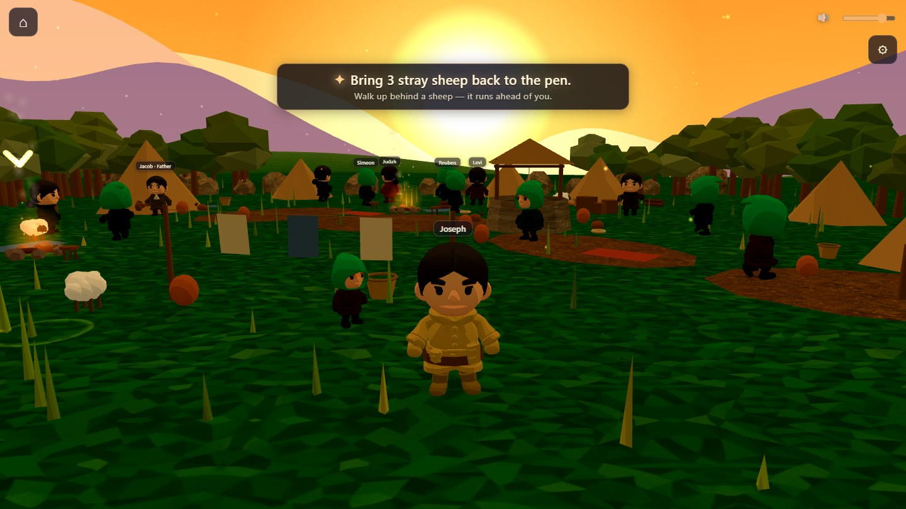
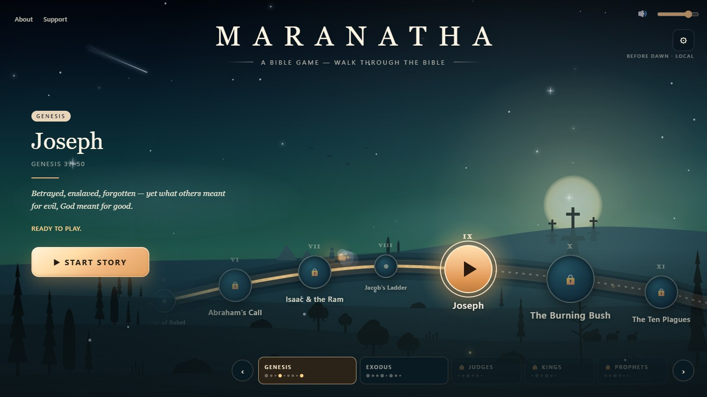
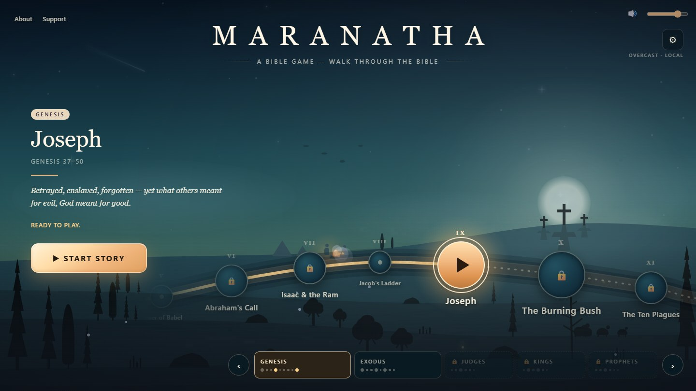
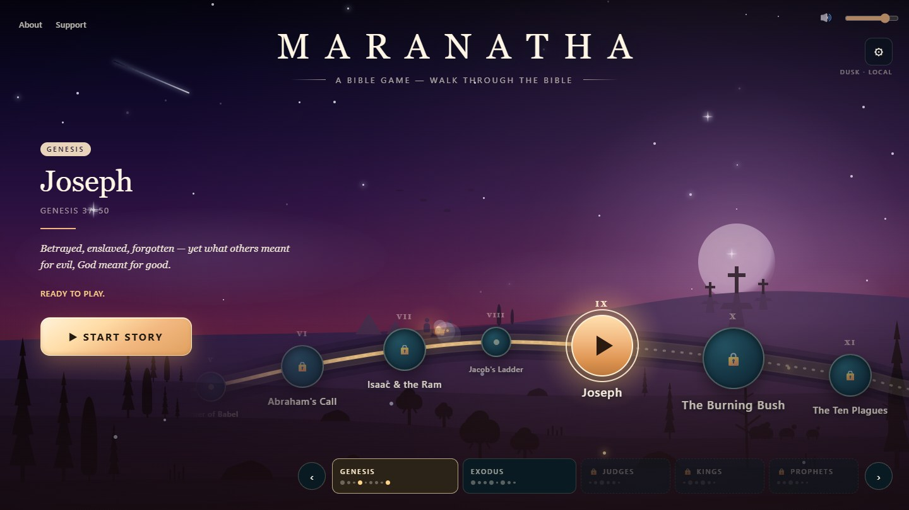
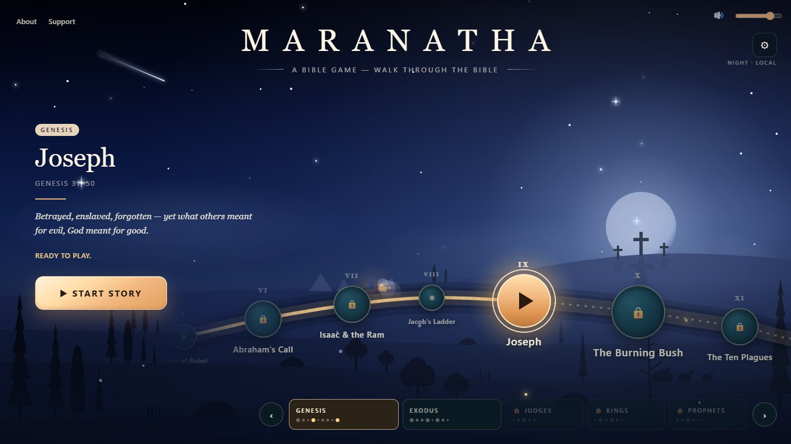
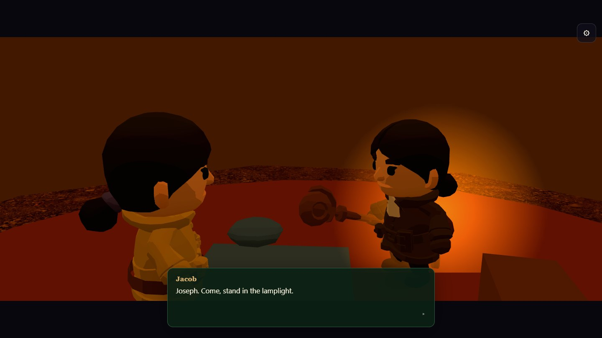
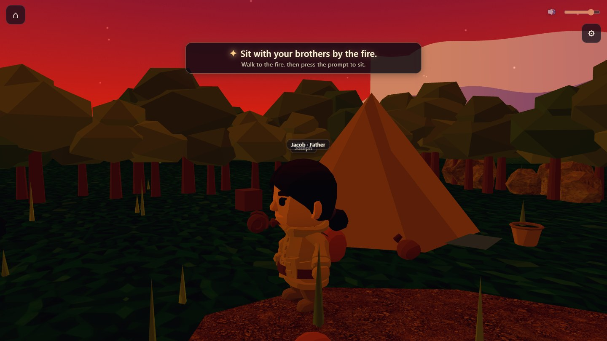
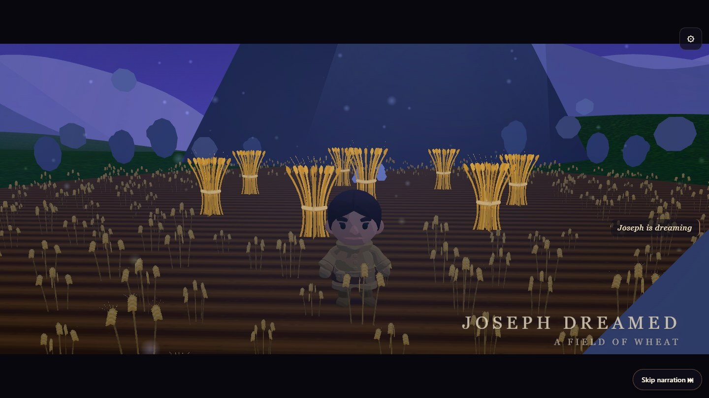
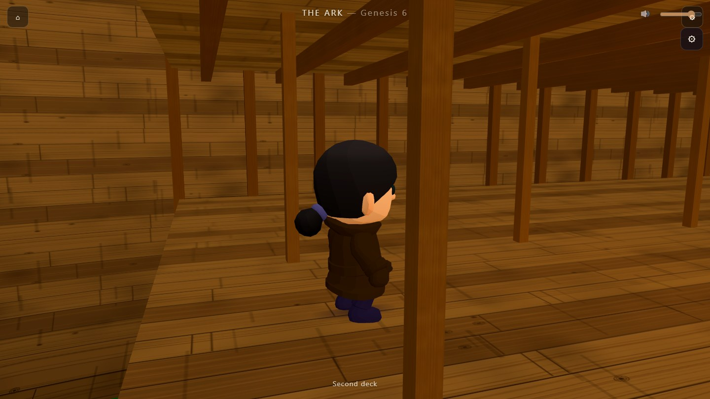
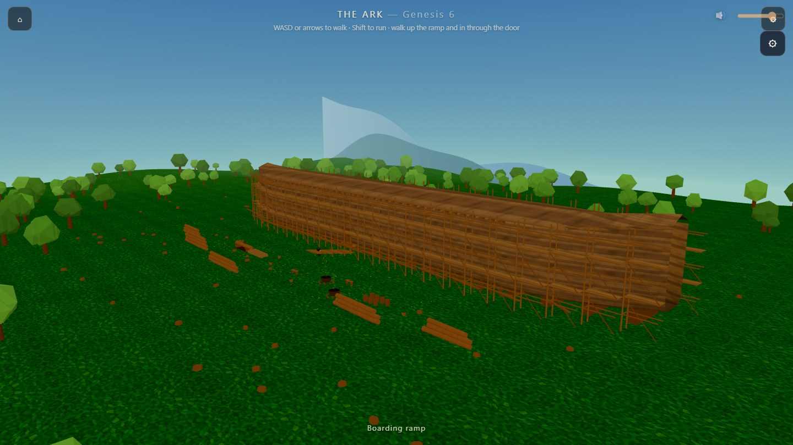

<div align="center">

# MARANATHA

***“Maranatha — Come, Lord.”***

**A Bible game.** Walk through the real events of Scripture in a hand‑drawn world
with the painterly stillness of *Alto’s Adventure* — so you come to know God, the
people of that time, and how His promise always comes true.

**No install. No login. No cost.** It opens in a browser and you are playing.

**[▶  Play now](https://tdg-org.github.io/MARANATHA/)**  ·  add `#debug` for a live FPS / draw‑call readout


-8a7f9e)

<br>



<sub><i>Hebron, first light. Jacob’s camp, his eleven sons, and a flock that will not stay put.</i></sub>

</div>

---

## ✨ What it is

You walk a character through a low‑poly 3D world beneath a real, gently‑moving camera.
You walk up to people, talk with them, and live each story exactly as Scripture tells it —
the real verse on screen and read aloud on every beat.

- 🎨 **A world drawn in code** — every sky, hill, tree, tent, coat pattern and wheat sheaf is
  *generated*, not painted by hand. Shader‑gradient skies, atmospheric haze, golden‑hour light.
- 🚶 **Walk & talk** — free movement, a gentle follow camera, dialogue that always names who is
  speaking, and soft on‑screen guidance so you are never lost.
- 🎬 **Real cinema** — authored camera shots, letterboxed cutscenes, engraved title cards and
  verse cards. Nothing cuts harshly; everything eases.
- 📖 **Faithful to the text** — the **World English Bible** (public domain), verified verse‑by‑verse
  against the canonical text and narrated in one baked voice.
- 📱 **Runs anywhere** — device‑adaptive resolution, instanced rendering and a frame pacer that
  locks to your display keep it smooth on a phone and quiet on a laptop.
- 🔒 **Private & instant** — no accounts, no ads, no tracking. Progress saves in your own browser.

## 🗺️ The story map

The home screen is the whole Bible as one road at night — 35 chapters winding from Creation
toward the end of the story. It is pure DOM and SVG, so while you are choosing where to go the
game submits **zero GPU frames**.

Its sky follows **your** clock, and you can pin it in Settings → *Map backdrop*.

<table>
<tr>
<td width="50%"><br><sub><b>Before dawn</b> — the horizon goes green before the sun is anywhere.</sub></td>
<td width="50%"><br><sub><b>Overcast</b> — flat, soft, the stars mostly gone.</sub></td>
</tr>
<tr>
<td width="50%"><br><sub><b>Dusk</b> — the one that makes people stop and look.</sub></td>
<td width="50%"><br><sub><b>Night</b> — deep blue, a full moon over the three crosses.</sub></td>
</tr>
</table>

## 🎬 Inside the story

<table>
<tr>
<td width="50%"><br><sub><b>The coat.</b> Jacob calls Joseph into the lamplight. Every speaker gets their own colour.</sub></td>
<td width="50%"><br><sub><b>Dusk.</b> The sky turns while the brothers watch him wear it.</sub></td>
</tr>
<tr>
<td width="50%"><br><sub><b>The dream.</b> A field of wheat, and eleven sheaves that will not stay standing.</sub></td>
<td width="50%"><br><sub><b>Below decks.</b> Three storeys of timber you can actually walk.</sub></td>
</tr>
</table>

<div align="center">



<sub><b>The ark — 300 × 50 × 30 cubits.</b> At the World English Bible’s own footnote of an 18‑inch<br>
cubit that is <b>450 × 75 × 45 feet</b>, and it is built at exactly that size. Walk up the ramp and go inside.</sub>

</div>

## 🎮 Controls

| Action | Desktop | Touch |
|---|---|---|
| Move | **WASD** / **arrow keys**, or **click** a spot | on‑screen **joystick**, or **tap** a spot |
| Run | hold **Shift** | push the joystick fully |
| Talk / interact | walk close, press **E** | tap the **Talk** prompt |
| Advance dialogue | **Enter** / **Space** / **click** | tap |
| Pause | **Esc** or **⏸** | ⏸ |
| Home / leave a story | the **⌂** button (asks to confirm) | ⌂ |
| Settings — volume, graphics, frame rate | the **⚙** button | ⚙ |

## 📖 Stories

- **Joseph** — Genesis 37–50 · the first playable story.
  **Scene 1 — The Coat & the Dreams** (Genesis 37:1‑11) is playable now, end to end: herd the
  flock, receive the coat, live both dreams by night, and face the brothers’ jealousy. It opens
  on a flash‑forward to the pit, and it does not flinch. More scenes are on the way.
- **Noah’s Ark** — Genesis 6 · **a place, not yet a chapter.** The ark is built to full biblical
  scale and you can walk it, inside and out. Its story is not written yet — the world came first.
- **Creation**, **The Fall**, **Babel**, **Abraham**, **Moses**, and on toward Revelation — the
  road is drawn and the chapters are waiting.

## 🚀 Run locally

```bash
npm install
```

```bash
npm start
```

Dev server on **http://localhost:1225** (a fixed port, so it never clashes with anything else),
and it opens your browser for you.

```bash
npm test
```

The full suite — 20 groups, no browser and no dev server needed. It boots the real scenes in
Node in about a quarter of a second each.

```bash
npm run build
```

Production build to `dist/`. And `npm run shots` re‑captures every screenshot on this page by
driving the real game in headless Chrome, so these images can never quietly go stale.

## 🛠️ Tech

**Three.js · Vite · plain ES‑module JavaScript** — no framework, no TypeScript, and no runtime
dependency but Three.

Flat, yaw‑billboarded characters live in unlit low‑poly environments under one dithered
shader‑gradient sky dome, with fog for depth and instancing for everything repeated. The UI is a
DOM overlay, so text stays crisp at any resolution and a screen reader can reach it. Audio is a
channel‑mixed WebAudio graph (**Master / Music / SFX / Narrator**) with file‑first narration and a
procedural fallback. The menu does not even download the 3D engine — it is a separate chunk,
fetched only when you enter a story.

## 📁 Project layout

> `src/README.md` is the real code map — one line per module, kept current.

```
index.html          canvas + persistent DOM overlay
src/main.js         boot: registers screens, routes by URL hash
src/core/           app shell, renderer, frame pacer, adaptive quality, disposal
src/engine/         story-agnostic kit: camera director, controller, characters,
                    collision, particles, cutscene sequencer, interactables
src/scenes/         joseph3d/ (the live story, beats split by act) · noah/ (the ark)
src/systems/        audio, narrator, settings, graphics, save
src/screens/        home/ (the DOM story map) · pages.js (About/Support panels)
src/data/           verses (WEB, verified), narration, stories, audio manifest
src/ui/             dialogue, verse cards, HUD, pause, settings, joystick, loader
tools/              the test suite, the screenshot capture, the VO baking
```

## 📜 Notes

- Displayed scripture is the **World English Bible** (public domain), verified against the
  canonical text at [ebible.org](https://ebible.org/).
- Character models are **CC0** by [Kay Lousberg](https://kaylousberg.com/); rock and dirt textures
  are **CC0** from [Poly Haven](https://polyhaven.com/). Full credits ship beside the assets.
- Screenshots on this page are generated, not hand‑picked, so they show the game as it is today.
- The earlier Phaser 3 version is preserved on the
  [`phaser-archive`](https://github.com/TDG-Org/MARANATHA/tree/phaser-archive) branch.

<div align="center">

*Built with care. Every frame eases; nothing pops.*

</div>

## 📜 License

MARANATHA is **source-available, not open source**: you're welcome to read the code, fork
it, run it, modify your own private copy, and open issues and pull requests. Publishing,
hosting, or redistributing it — including a renamed or modified version — selling it or
using it inside anything you charge for, or using it as AI/ML training data, all need our
written permission first. Third‑party libraries, models, textures, and audio keep their own
licenses, which control for those pieces — see the credits for
[models](public/models/CREDITS.md), [textures](public/textures/CREDITS.md), and
[audio](public/audio/CREDITS.md).

Full terms: **[LICENSE](LICENSE)** · Copyright © 2026 Nate McIlvenny and Luke McIlvenny
(TDG). All rights reserved. Licensing and partnership inquiries: [natemci.com](https://natemci.com).
